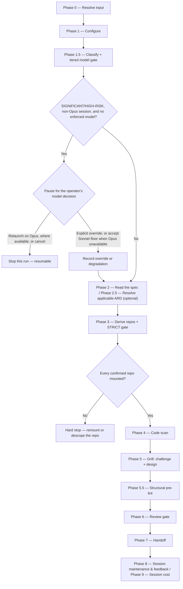

# /design

Takes over a merged specification from the specs repo's main branch, grounds strictly in the fully-mounted implementation code, and authors a reviewed engineering `design.md` through a relentless grill that challenges the spec and designs the implementation.

## Who runs it

`/design` runs in the [dev](../roles-and-phases.md#dev--build-verify-and-deliver) role, cost-attribution phase [planning](../roles-and-phases.md#planning) — being in this phase means an engineering `design.md` is being authored from a merged specification, grounded strictly in the mounted code.

## Synopsis

```
/design <ADDRESS> [--design-twice] [--no-arch] [--skip-costs] [--skip-feedback] [--enforce-model=<model>]
```

`/design` is **address-required** — a plain prompt with no positional address, or a token that is not a key (bare, behind its folder's kind prefix as `EPIC-<KEY>`, or as its folder's whole name), stops with `DESIGN_NEEDS_KEY`, and an address that resolves to no folder stops too, naming the commands that create one. Resolution supplies the address and nothing else: the requirements source of truth is the merged `specification.md` in the specs repo. The folder's prefix sets the altitude — an `EPIC-` folder designs that Epic, a `PRD-` folder works at PRD level — never the kind it asserts, and a legacy folder with no prefix is placed by what it holds. A BRD container holds no specification to design against and stops the run (`DESIGN_BRD_NOT_SLICED`), naming each of its slices instead or, where it has none, `/product-workflows:brd-split` to carve one.

**The Epic is the unit of work — one `design.md` per invocation, no fan-out.** When the address names an Epic folder, that Epic is the scope. When it names a PRD folder, `/design` inspects the resolved PRD directory in the specs repo itself: a flat `specification.md` there (a broad PRD-level spec — the only shape that puts one at PRD level, since every `EPIC-` folder sits under a PRD folder) means one design at that level, **and on a single-component PRD it is tested first, so a PRD folder holding both that file and Epic subfolders designs the slice and is never offered an Epic here** (a multi-component one goes to the Epic picker — see *Multi-component PRDs*) — each Epic's own `design.md` is reached by addressing that Epic, `/dev-workflows:design <EPIC-KEY>`, which is how a PRD of that shape reaches *Ready for Implementation*, the rung wanting a spec and a design on every in-scope Epic and on the slice alike. Otherwise Epic subfolders are enumerated by which ones already carry a `specification.md` merged to main, and rendered as a progress-aware picker — ○ not started (a specification exists but no design and no in-progress session), ◐ in progress (a design session exists but no `design.md` yet, selectable as a resume), ● done (`design.md` exists, shown greyed, offering *revise* instead of a fresh run). Exactly one spec'd Epic auto-selects with no picker. `--design-twice` forces the Phase 5 interface fan-out even when no contested-interface signal fired — the run says which interface it forced it on, and skips the offer described below entirely.

All three run flags apply to this command. `--skip-costs` (or `WORKFLOWS_SKIP_COSTS`) skips Phase 9's session-cost entry, still advancing the checkpoint and dropping any deferred cost record a ceded `/prompt-brainstorm` or `/prompt-grill-me` run left pending in this session (`workflows-core:run-flags` §5 step 3) — see [Session cost](../reference/session-cost.md). `--skip-feedback` (or `WORKFLOWS_SKIP_FEEDBACK`) narrows Phase 8's maintenance step to bugs-only, dispatching `defect-reporter` in place of `impl-maintenance` — see [Session feedback](../reference/session-feedback.md). `--enforce-model=<model>` (or `WORKFLOWS_ENFORCE_MODEL`) pins every dispatched agent in this run — `design-reviewer` included, overriding its frontmatter Opus pin — to one model, and it is also the one flag that changes a *gate*: Phase 1.5's HARD gate does not fire under it, since the user has already chosen the model — see [Model routing](../reference/model-routing.md).

## How it runs

`/design` has 13 `## Phase` headings. The diagram below highlights the tiered model gate, its explicit override paths, and the strict repo-mount gate. They are not the run's only stopping conditions: the `require-on-main` specification gate and an `unmerged` ARD both stop it too, and both are described under `## What it needs`.



Five subagents are dispatched along this path: `workflows-core:code-scanner` (Phase 4, one instance per confirmed repo, batched up to 4 concurrent), `workflows-core:architecture-grounder` (Phase 4, after the code scan, read-only grounding on the architecture repository and the team's harvested decisions — ON when either resolves, advisory, never a gate; on the §2 Opus chain, pinned by its dispatch), `interface-designer` (Phase 5, three parallel takes, only when the fan-out runs), `design-reviewer` (Phase 6, the Opus review gate), and `workflows-core:impl-maintenance` (Phase 8, session lessons-learned). `code-scanner`, `interface-designer`, and `impl-maintenance` all run at the caller's `detection_model` — the Sonnet chain — never on a fixed pin; `design-reviewer` keeps its frontmatter Opus pin regardless of classification (unless `--enforce-model` overrides it). The grill and the `design.md`/`specification.md` authoring itself run **inline** on the session's own `current_model`, not through a delegated subagent — which is exactly why the Phase 1.5 tiered gate exists: unlike `design-reviewer`, there is no subagent this run can fall back on to get Opus judgment if the session itself isn't running on one.

Phase 5 conducts the design as a relentless, one-question-at-a-time interview running two intertwined tracks: it **challenges the spec** — recording every substantive challenge back onto `specification.md` under a new `## Engineering review` section, raising acceptance-criteria or test-case changes as proposals rather than unilateral rewrites — and it **designs the implementation**, authoring each `design.md` section as the interview settles it. When the interview reaches an interface decision that is *contested* — two or more plausible adapters for the same seam, an interface spanning a process or network boundary, three or more callers sharing the shape, or two or more candidate shapes already recorded in the design session with none eliminated (`../../references/design-format.md` `## Seams`) — it offers a three-take `interface-designer` fan-out: one take per constraint (minimise the interface, maximise flexibility, optimise for the most common caller), dispatched in parallel and compared on named axes — depth, locality, seam placement — rather than impressions. Each take is handed the feature folder's term records, `/specify`'s `_glossary.md` and this command's `_design-glossary.md` — on a per-Epic design, the PRD folder's `_glossary.md` too — whichever exist, so the three name the interface in the project's terms rather than three vocabularies of their own. `--design-twice` forces this same fan-out and skips the offer, because a user who typed the flag has already given the answer the offer would ask for. **Declining the offer costs nothing:** the interview simply continues, and `design.md`'s unconditional `### Alternatives considered` requirement is satisfied by hand, exactly as it would have been anyway.

### Multi-component PRDs

On a PRD with two or more code components, `/design <PRD>` does not design the PRD-level specification as one unit unless you choose to: it goes to the Epic picker, and with no specified Epic it recommends `/epics` (no Epics yet) or `/specify` (Epics not yet specified) first; designing it whole anyway is your override. At Epic level — on any PRD, multi-component or not — the repository set starts from the Epic's `target:`; adding a second repository asks whether to re-split the Epic (where the PRD-level ARD's set holds that repository — `/epics <EPIC>`, naming the move at its plan approval) or record the component in the ARD with `/create-ard` first, and adding it anyway records a `Target span` risk that `design-reviewer` flags. The design header names the target, and `## Interfaces / contracts` names each interface the Epic produces or consumes, with the stub its test strategy uses for each one it consumes, save one a contract Epic builds as code, which it uses as built, and one that already exists, which it uses as it runs.

## What it needs

- **`$SPECS_PATH`** — must resolve; `/design` reads `specification.md` from there and writes `design.md` back into the same feature folder. If unset, the run stops and asks for a path.
- **A PRD or Epic address** — a key, or an `@<path>` to its folder, resolved against `$SPECS_PATH`; with no address, or a token that is not a key — bare, behind its folder's kind prefix, or as its folder's whole name — the run stops (`DESIGN_NEEDS_KEY`), because `/design` has no direct-prompt behaviour. An address that resolves to no folder stops before the specs-repo preflight, naming what creates one (`/product-workflows:idea`, `/product-workflows:create-prd` or `/product-workflows:brd-split` for a `PRD-` folder, `/product-workflows:epics` for an `EPIC-` one); one that resolves to several stops naming every match. **An address that resolves to a BRD container** — a `BRD-` folder, or an unprefixed one carrying a coverage ledger or a BRD inventory and no `brd-link.md` naming a `parent:` — stops too, after the specs-repo preflight has settled the specs checkout's branch and before anything else is read (`DESIGN_BRD_NOT_SLICED`): a BRD's specifications, and so its designs, belong to its `PRD-` slices, and the stop lists them or, where there are none, says how to get one.
- **The merged `specification.md` itself**, gated on the specs repo's main branch. **Of this plugin's three gated inputs this is the one that genuinely stops on absence** (`workflows-core:phase-handoff` §3): this plugin's other gated inputs fall back to prior behavior when absent and report it (the `product-workflows` commands whose gated input was never optional stop too — §3.4 names them), but here no specification anywhere is a hard stop — `no specification.md exists yet for this item — run /product-workflows:specify for it and merge it to the specs repo main first.` An *unmerged* spec (an open pull request, not yet on main) also stops, naming the branch and any PR — as `/implement`'s gate does, whereas `/ready` records an unmerged gated input as a finding and carries on (§3.3 rows D/E).
- **An optional ARD** (Phase 2.5) — `status: none` skips silently; `status: unmerged` stops, naming the branch/PR; `status: found` carries its invariants into the grill, and a necessary deviation is recorded as an `## ARD deviations` section plus an open question, never edited into the ARD itself.
- **Every implementation repo the design must span**, mounted under `$REPOS_PATH` — Phase 3's **STRICT** gate. Unlike the companion `product-workflows` plugin's `/specify` and its soft repo gate, which proceeds without a repo it cannot resolve, `/design` hard-stops on any confirmed repo that isn't mounted: it must see all implementation repos to design against them, so the developer either remounts and re-scans, or explicitly removes the repo from scope.
- **`$ARCHITECTURE_REPO_PATH`** (optional) — architecture grounding, as in `/product-workflows:create-ard`: a clone of your organisation's architecture repository (radar, standards, principles, patterns, ADRs), shown on an `architecture grounding:` line in Phase 1 and never fetched or pulled. The team knowledge base `$SPECS_PATH/architecture/`, once `/product-workflows:harvest-decisions` has built it, is read as a second root on a `team decisions:` line. After the code scan, `workflows-core:architecture-grounder` returns what binds the work and what conflicts with it; the grill puts what binds to you as a confirmation, and `design.md` cites a binding artifact as a link in the section whose decision it settles; each departure is an `Architecture deviation:` line under `## Risks & mitigations` for the architect — advisory, never blocking handoff ([`design-format.md`](../../references/design-format.md) § Architecture governance). Decisions the run already inherits from its ARD are not read again from their harvested copies; every other team record, a sibling Epic's included, is. Missing, it turns OFF with a reason and the run proceeds as without it; turned off with `--no-arch` ([Environment](../reference/environment.md)).
- **The model decision for `SIGNIFICANT`/`HIGH-RISK` work** — unless `run_flags.enforced_model` is set, Phase 1.5 pauses a non-Opus session because the grill and `design.md` authoring run inline rather than through a delegated subagent. The operator can relaunch on Opus, explicitly override and continue on the current model with the choice recorded, or cancel. Where no Opus tier is available, the choice is to accept the recorded Sonnet-floor degradation or cancel, not to relaunch onto an unavailable model. `SIMPLE`/`MODERATE` work on a non-Opus session gets only a soft advisory. Model enforcement bypasses both gates; it pins dispatched agents and does not change the inline session model. See [Model routing](../reference/model-routing.md) for the fallback chain and why this differs from the companion `product-workflows` plugin's `/specify` and `/create-prd`.

## What it produces

`design.md` (flat, alongside `specification.md`), authored against `../../references/design-format.md`; the amended `specification.md` (its new `## Engineering review` section and open-question edits); `_design-session.md` (the interview record, including every live interface candidate as it arose, not only the settled one); and `_design-glossary.md` (ambiguous terms captured during the grill). Phase 7 refuses to write a handoff while `design.md` still carries any unresolved open question — the decision-completeness gate.

A boundary interface — one the change introduces or alters on the producing side, which another component (a repository, or a module of one) or a consumer outside the system calls or receives the messages of — is stated beyond its shape: what a caller gets on each failure, its side effects, and whether a repeated request repeats one, or, for an altered one, the behaviour the change touches. Each gets a producer-side test that drives the real implementation, failure cases included, since a consumer's stub never shows that the producer conforms; a design that only builds a contract file checks the file instead. On a multi-component PRD whose ARD names the contract file, a consumer in another repository than the file's names how it gets it, a package pinned to a version or a copy recording its source and revision, and never edits the copy in place. `design-reviewer` flags each rule broken.

A change to behaviour a deployed system runs — a service, a job, an agent, a UI people reach — also gets `## Observability & release verification`, settled in the grill before any code: the signals that show it working or failing, their baseline, what the change can hurt, a post-release check for each acceptance criterion it delivers, the alerts and service-level objectives it moves, and the threshold that triggers a rollback. Anything that does not apply says why, and any other change marks the whole section not applicable.

Behind a consent choice, Phase 7 hands the feature folder off via `handoff-to-main`: a branch (`design/<EPIC>-<eslug>` for a per-Epic design, `design/<PRD>-<vslug>` for a broad PRD-level design), commit, push, and an opened pull request to main. Merged-to-main is what `/implement` gates on next. For a per-Epic design selected from a multi-Epic PRD's picker, Phase 7 additionally offers "Next Epic" once the write/commit completes — re-opening the picker minus the just-completed Epic (now showing done) and looping back through Phases 2–7 for the next selection; this does not apply to a single-Epic PRD or a broad PRD-level design.

## Gates

Phase 6 dispatches `design-reviewer` (Opus, frontmatter-pinned) against `design.md`, `specification.md`, the classification, and any ARD invariants — and, for an Epic with a target, its target paths, `## Contract` lines, the ARD interface rows they cite and ride-along lines, which its *Target & contract* check reads. **Any unresolved open question in `design.md` is a BLOCKER by policy** — this is the gate a `/design` run actually hits, since the interview is required to resolve every open question to zero before Phase 6, pushing a genuinely undecidable one onto the spec instead. On `BLOCK`, the orchestrator/grill fixes the BLOCKER findings inline (no delegated writer), reads the fix against every line, in any section, that governs the same behaviour — and an operational step, such as a rollout restart, against everything its selector reaches in the deploy files — so the re-review is not spent on a defect the fix itself wrote, and re-reviews once. `MAJOR` / `MINOR` / `NIT` findings, whatever verdict carried them, carry no mandatory fix cycle: after the first review and after the re-review alike, the run offers to apply the ones a verdict that is not `BLOCK` leaves open, each read against what it overlaps as a fix is, and where the first review's were applied, the re-review the cap still holds is offered once before the handoff; a finding not applied is listed in the final report and the pull request. Cap: one fix cycle plus one re-review — an unresolved BLOCKER after that is escalated individually rather than looped on. See [Model routing](../reference/model-routing.md) for the Opus fallback chain `design-reviewer` resolves against.

Ahead of the review, Phase 5.5 runs a structural pre-lint against the drafted `design.md` — advisory only, and it never blocks: it surfaces findings and inline-fixes the mechanical ones (a stray placeholder token), leaving content gaps for the grill to resolve. Phase 1.5's tiered model gate pauses for the operator's decision unless model enforcement bypasses it; the explicit override and accepted Sonnet-floor paths continue with the decision recorded. Phase 3's STRICT repo gate stops the run, as does every input stop under "What it needs" — a missing `$SPECS_PATH` or address, a BRD container, an absent or unmerged `specification.md`, an unmerged ARD. Phase 6 can send BLOCKER findings through a fix cycle rather than stopping immediately.

## Example

Design a per-Epic implementation for an Epic whose specification is already merged:

```
/dev-workflows:design EPIC-98760
```

The run resolves `EPIC-98760` as the focus Epic within PRD `PRODUCT-1234`, gates its `specification.md` on the specs repo's main branch, resolves any ARD, derives and confirms the implementation repos, hard-stops if any is unmounted, scans the confirmed set, then grills you through challenging the spec and designing the implementation — offering the three-take interface fan-out if a seam turns out contested. Once `design-reviewer` passes, it offers to branch, commit, push, and open a pull request; once that pull request is merged, `/dev-workflows:implement EPIC-98760` can start.

## See also

- [Roles and phases](../roles-and-phases.md) — what the `dev` role owns, including this plugin's one exception where an absent gated input stops the run rather than falling back.
- `/product-workflows:specify` — the upstream command, shipped in the companion `product-workflows` plugin, whose merged `specification.md` `/design` requires before it will start.
- [`/implement`](implement.md) — the downstream command that will not start against this design until its pull request is merged.
- [Model routing](../reference/model-routing.md) — the classification, the Opus fallback chain, and why `/design`'s tiered gate stops rather than degrades.
- [Session cost](../reference/session-cost.md) and [Session feedback](../reference/session-feedback.md) — the terminal Phase 8–9 bookkeeping every run emits.
- [`design-format.md`](../../references/design-format.md) — the canonical structure `design.md` is authored against, including the `## Seams` section's contested-interface signals.
- `workflows-core:ard-resolution` — how the optional ARD is resolved and inherited.
