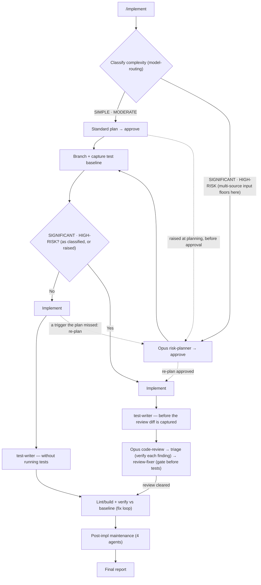

# /implement

Classifies a task's risk, creates a branch, plans and implements the change, writes tests, runs an Opus code review, and performs post-session maintenance.

## Who runs it

`/implement` runs in the [dev](../roles-and-phases.md#dev--build-verify-and-deliver) role, cost-attribution phase [implementation](../roles-and-phases.md#implementation) — being in this phase means code is actually being written, tested, and reviewed.

## Synopsis

```
/implement <ADDRESS> | <prompt> [@file…] [@spec-folder] [@repo…] [--no-commit] [--skip-costs] [--skip-feedback] [--enforce-model=<model>]
```

`$ARGUMENTS` resolves to one of two modes: **keyed** when a positional address is present — a `<KEY>`, or an `@<path>` naming a folder in the specs tree — and **direct** otherwise (free-text or `@file`). The keyed branch resolves through `workflows-core:addressing` §3, the same entry point `/document` uses.

`/implement` implements **one Epic per run**. When the resolved item already names a focus Epic (a bare Epic key — the folder's `EPIC-` prefix sets the altitude, never the kind it asserts, and a legacy folder with no prefix is placed by what it holds; no second positional is accepted), that Epic is the scope. A BRD container holds no Epic to implement and stops the run (`IMPLEMENT_BRD_NOT_SLICED`), naming each of its slices instead or, where it has none, `/product-workflows:brd-split` to carve one. That stop, and the folder read below, are taken only after the specs-repo preflight has settled the specs checkout's branch, so a stale plugin branch cannot hide a slice, an Epic or its artifacts. On a run carrying `specs_git: misrooted` (a misplaced `$SPECS_PATH`) the preflight switches no branch; it names a stale one it stays on, and that branch can still hide them. When the PRD is bare, a cheap folder read classifies it (on a multi-component PRD the flat-specification cases below never arise — see *Multi-component PRDs*): a PRD with exactly one Epic sets that Epic as the scope automatically, unless the PRD folder also holds a flat `specification.md` — a broad PRD-level slice, which `/design` designs as one unit — in which case it asks which of the two to implement, with no recommendation; a PRD with two or more Epics renders a **progress-aware picker** — each row showing the Epic's own artifacts (`specification.md` but no `design.md` → ○ not started; `design.md` present but no block in `implementation.md` → ◐ in progress, selectable and where the default cursor lands, since a merged design is exactly what this command wants; an `implementation.md` holding at least one block (a file holding only its heading records nothing) → ● done, greyed and not default-selectable, and selecting it offers to implement again), plus, **on the same condition as the one-Epic case above — only where the PRD folder also holds a flat `specification.md`** — the explicit choice to implement one broad PRD-level slice instead, since without that file the slice is a unit nothing specified: with it, that choice counts against the prompt's four options, so the array names at most two Epics and lets you type the key of any other; without it, the array names at most three and lets you type any other; a PRD with no Epics offers to split with `/product-workflows:epics` first, or to implement a broad PRD-level slice. Selecting an Epic scopes that run only — there is no "next Epic" loop, because code-writing is heavy and branchy enough that each run targets one Epic.

All three run flags apply to this command. `--skip-costs` (or `WORKFLOWS_SKIP_COSTS`) skips Phase 7's session-cost entry, still advancing the checkpoint and dropping any deferred cost record a ceded `/prompt-brainstorm` or `/prompt-grill-me` run left pending in this session (`workflows-core:run-flags` §5 step 3) — see [Session cost](../reference/session-cost.md). `--skip-feedback` (or `WORKFLOWS_SKIP_FEEDBACK`) narrows Phase 4's maintenance step to bugs-only, dispatching `defect-reporter` in place of Agent 4 (`impl-maintenance`) — see [Session feedback](../reference/session-feedback.md). `--enforce-model=<model>` (or `WORKFLOWS_ENFORCE_MODEL`) pins every dispatched agent in this run — `risk-planner` and `code-review` included, overriding their frontmatter Opus pin — to one model, bypassing the fallback chains `model-routing/classification` §2 and §2.1 otherwise select — see [Model routing](../reference/model-routing.md). In direct mode, the free-text `<prompt>` is protected the same way: a run flag forms a leading run — mixed, in any order, with this command's own `--no-commit`, an address/key and any `@path` token (`workflows-core:run-flags` §3 step 1) — before the prompt begins, or a trailing run at the very end, which may carry `--no-commit` and `@path` tokens too; a run flag in either position is stripped, one written inside the prompt itself is kept as prompt text.

## How it runs

`/implement` has 19 `## Phase` headings. Rather than walk every one, the diagram below deliberately names none of them: it compresses the whole run into its two real decision points — and the dotted edges a change of class takes — instead of naming each phase.



`IN` covers Phase 0 through Phase 1.8 — loading and classifying the input, the Phase 0.5 readiness pre-flight, clarification (which, on a keyed run, first resolves the applicable ARD, then looks in the inputs, the code, the repository's own docs, `git log` and the ARD's rules before it asks, and asks only what would change the result), and, only when the input is multi-source, the Phase 1.6 floor at SIGNIFICANT and the Phase 1.7 fan-out scan it triggers. `BR` covers Pre-Phase 3 (branch creation) and Pre-Phase 3.5 (test-baseline capture) together — the baseline is always captured immediately after branching and before any file is edited, on either path. `G` is not a new decision: it is the class as it stands, drawn where the two paths part — Phase 1.5's, as the multi-source floor or a down-classification accepted at plan approval left it, or raised before any file is written when Phase 2A's plan shows a classification trigger (such as more than 3–5 non-test files, authentication, a schema or migration, or a public contract — the dotted `P1` → `P2` edge); after a down-classification you accepted at plan approval, only a trigger a later revision adds raises it. A run that meets such a trigger while implementing, one its approved plan did not state (one of the concrete triggers the [classification policy](../reference/model-routing.md) lists, not its catch-all of unclear requirements, large unknowns or otherwise high blast radius, whose unknowns are asked about instead), re-plans upward: `risk-planner` plans the rest with the diff so far, and once you approve, the run continues on the review path without re-branching or re-capturing the baseline (the dotted `IMA` → `P2` → `IMB` edges); cancelling that re-plan commits the work (unless `--no-commit`), and any pull request the run opens is a draft. That happens once per run: should you accept a down-classification at the re-plan, a later trigger is put to you instead — continue without the review, or stop, which commits the work as cancelling the re-plan does. `IMA`/`TWA` are Phase 3A and Phase 3.5's `test-writer` dispatch, which runs no tests; `IMB`/`TWB` are Phase 3B and its step 4a, which dispatches `test-writer` before the review diff is captured. `RV` is Phase 3B's review-triage-fixer sequence, which therefore sees code and tests together. `TS` runs lint/build, the `test-baseliner` verify against the captured baseline, and the fix loop — after `RV` clears on the reviewed path. A recorded test skip still runs lint/build and is reported, as described under Gates below. `MT` is Phase 4's four maintenance agents. `RP` is the Phase 5 Final Report — folded into it is Phase 4.5 (a silent no-op unless Phase 3B's review escalated spec/design conformance notes onto a spec/design in the specs repository, a note written into this repository's own spec riding on the code commit instead; otherwise its handoff outcome line appears in the report's own `### Spec/design conformance` section), which runs between Phase 4 and `RP` and is not separately pictured. Two more phases sit in the same gap and are likewise not pictured: Phase 4.6, the code-repo handoff that commits the work and — behind a consent choice — pushes it and opens a pull request, and Phase 4.7, which appends this run's refs to `implementation.md` on a keyed run — in the folder of the unit it implemented: the Epic's, whether you named the Epic or the picker chose it, or the PRD folder's for a broad PRD-level slice. Two further terminal phases run after `RP`: Phase 6 (follow-up tasks, written into the same unit's folder as Phase 4.7's record) and Phase 7 (session cost, plus the terminal artifact commit).

Seven named subagents are dispatched: `workflows-core:code-scanner` (Phase 1.7, only when the input is multi-source — one `code-scanner` per repo, capped at 4 concurrent, plus a seeded round 2 for any theme round 1 left inconclusive), `risk-planner` (Phase 2B, `SIGNIFICANT`/`HIGH-RISK` only), `test-baseliner` (captured in Pre-Phase 3.5, verified again in Phase 3.5), `test-writer` (Phase 3.5, or step 4a of Phase 3B before the review diff is captured), `code-review` (Phase 3B), `review-fixer` (Phase 3B, only on a `BLOCK` or `PASS WITH RECOMMENDATIONS` verdict), and `workflows-core:impl-maintenance` (Phase 4). All but `risk-planner` and `code-review` run at the caller's `detection_model` — the Sonnet chain; those two keep their frontmatter Opus pin regardless of classification (unless `--enforce-model` overrides it). Beyond those seven, general-purpose agents are dispatched too: a read-only codebase-exploration subagent at Phase 2A (none where a down-classification you accepted at Phase 2B sent the run there, its exploration being already written) and at Phase 2B only where no exploration this run made (Phase 1.7's, Phase 2A's or an earlier pass of Phase 2B's own) has written the codebase summary, on the same Sonnet chain; and Phase 4 dispatches three general-purpose agents (a documentation review, a knowledge-base review, and an instructions review) alongside `impl-maintenance` — all four in a single message, independent of each other.

### Multi-component PRDs

On a keyed run for an Epic carrying a `target:`, Phase 1 checks that the target is in this repository, on any PRD. Every keyed run first reads back the open follow-ups addressed to this repository and this unit — a change a run of the unit in another repository found this one needs — from the unit's `follow-ups.md` as checked out and as on the specs repo's default branch, prints them, and adds their changes to the description. Run from a repository other than the Epic's target, a run that finds one recommends a **companion run**: it implements only those changes, since the Epic's own change is already in its target's repository, so it does not scan for, plan or review against the Epic's requirements, and its pull request names the change it completes; the next step tells you to tick each task a run answered — a companion run's, or any whose changes joined a run's description — once its change merges. A follow-up that names a repository its run was not given — save one named for the Epic's target — may name this one under another name, so the run prints those too and asks, recommending nothing where a printed name is a known repository's or this repository is itself one of the PRD's components. With no such follow-up it recommends stopping and running the Epic in its target's repository. Either question also offers to implement the whole Epic here anyway. On a PRD with two or more code components it also checks that the ARD's `## Contracts`, the PRD-level specification, and the Epic's own specification and design are on the specs repo's default branch; that the Epic carries a target from the PRD's set; and that its `## Contract` agrees with the ARD — every new or changed interface it consumes is produced by some Epic, every one it produces is its target's, every `[AD#N]` it cites is an interface, and it depends on each producer of what it consumes. A gap asks whether to stop and run the missing step first (recommended) or to continue, and continuing names the gap under the pull request's *Merge danger*. Addressed by its PRD, a multi-component PRD's flat specification is offered as a slice to implement only where the PRD has no Epic yet, and then not as the recommended choice.

## What it needs

- **The resolved input itself** — classified in Phase 0: free-text prose plus any `@path` tokens, each classified by inspection, with a key or specs folder resolved against `$SPECS_PATH` through `resolve-address`. A key that resolves to no folder stops the run, offering to re-enter it or cancel — it never falls through to a direct-prompt run. A key given while `$SPECS_PATH` is unset stops before it is resolved, naming the variable and offering to set it or cancel, since there is no tree to find it in; an `@<path>` address names its folder directly and runs without the variable. Run it from inside the repository it is to change: it changes the repository it is run from, and started outside every git work tree it stops straight after reading its run flags — before it resolves an address, touches the specs repository or asks which Epic — showing git's error where git gave one. Run from inside the specs repository itself — the repository whose top level `$SPECS_PATH` is — a run given a key or a specs folder stops once the address resolves, before it touches the specs repository, telling you to run it from the code repository; a direct run there goes on, with one line saying it branches and changes the specs repository, its session files included, which are committed on that branch and go out only when it is pushed. The directory you run it from lies in that code repository and is never read as a spec folder itself, so a `prompt.md` or `*-design.md` file in it is read only when you name it: by file, or, below the repository's top level, by naming the directory (`@.`), which is then classified like any other `@path` — a folder holding those files is read as a spec folder. An `@path` at a repository's top level is read as a code repository, with a notice where it also holds `prompt.md` or `*-design.md` files (name those by file to read them). A path that does not exist, or a directory or file of no recognized kind, is named as each input is classified, and an unreadable file stops the run, both before the specs-repo preflight. A direct run with no description — no prose, and no spec file or spec folder named — stops there too, listing the forms a description takes (a key among them) and any `prompt.md` or `*-design.md` file in the directory you ran it from. If the primary description is a design doc (`/design`'s output) carrying unresolved open questions, `/implement` refuses to proceed by default — a design must be decision-complete before implementation; overriding is logged in the Final Report. A `specification.md`-level open question is exempt, since the design phase is where those are meant to resolve.
- **Specs, for keyed runs.** When Phase 0's address resolution finds no `specs` at all, `/implement` prompts for one rather than planning blind. Direct-mode runs are exempt — the prompt or spec file supplied is the instruction.
- **Any in-scope `specification.md`/`design.md`, gated on `$SPECS_PATH`'s main** (Phase 0). An *unmerged* one (an open pull request, not yet on main) is a hard stop, naming `$SPECS_PATH` explicitly since `/implement` stands in a code repo, not the specs repo. An **absent** one is not a stop at all — the run behaves exactly as it did before this gate existed (on a multi-component PRD, Phase 1 asks about a missing Epic specification or design, offering to continue — see *Multi-component PRDs*), and a direct-prompt run, which resolves no in-scope spec, is unaffected either way. This is the reverse of `/design`'s `specification.md`, which stops on absence (see the [`/design`](design.md) page).
- **The multi-source rule** (Phase 1.6): more than one distinct code repo (counted by top level, so an `@path` whose top level is already counted adds none), or any folder input (a specs folder or a spec/design folder), floors classification at `SIGNIFICANT` — overridable at plan approval — and triggers the Phase 1.7 fan-out scan in place of the single Explore subagent. The run changes code only in the repository you run it from: every other code repository it is given is read-only context, and the changes one of them needs become one follow-up for that repository — shared with any other whose `origin` URL ends in the same name: a task Phase 6 files on a keyed run that finishes (a direct run lists it in its report), named in the stop message on one that stops after plan approval. Where the plan changes no file in this repository at all, the run asks, in place of plan approval, whether to revise the plan or stop with nothing written, naming the run each other repository needs. **A referenced directory that is missing, or that is neither a recognized folder type nor a git repo, is always surfaced to the user immediately and never silently skipped** — the run asks whether to continue without it or stop.
- **An optional ARD** (resolved at the start of Phase 1's clarification, which reads its rules; Phase 1.8, keyed runs only) — `status: none` skips; `status: unmerged` stops, naming `$SPECS_PATH` explicitly; `status: found` carries its invariants as implementation guardrails, passed to `code-review` as `applicable_ard` on the `SIGNIFICANT`/`HIGH-RISK` path (guidance only on `SIMPLE`/`MODERATE`, which has no review gate).
- **A clean working tree**, or explicit consent to stash or proceed dirty, before Pre-Phase 3 creates the feature branch (on a dirty tree, a file of yours the run then changes is committed whole, your earlier changes with it; a stash sets aside your tracked changes except in the specs the run reads — its spec files, and any specs folder inside the repository — which it names, and leaves your untracked files where they are) — never implemented directly on the default branch. A run that stashed names the stash wherever it ends: in the stop's own message, or in the `Code repo:` line, under `--no-commit` too.

## What it produces

Code changes on a freshly created feature branch — named per the target repo's own documented convention, or `<prefix>/<key>-<slug>` as the fallback — **committed** in Phase 4.6 without asking, then pushed and opened as a pull request behind a three-option consent choice (push + PR recommended, push only, or neither). The one question before the commit is a possible secret: the lines it adds are scanned first, and where the scan finds a token, key or password it cannot dismiss as a placeholder, it shows you where — never the value — and asks whether to stop and leave the work uncommitted so you can remove it, or commit it as not secret. The commit subject ends with `[<key>]` — the key of the unit the run implemented, which the branch name carries too: the Epic's wherever it implements an Epic, even one the picker or the one-Epic path chose under a PRD address, and the PRD's for a broad PRD-level slice — and carries a `Work-Item:` trailer where that unit's folder has one, which is what lets `/document` and `/release-notes` find the work later. A run whose review or tests did not clear is committed like any other, and still *offered* for push and pull request under the same consent choice — a failed gate never downgrades what you are offered. What changes is the pull request itself: where one is opened it is a draft whose body leads with a DO-NOT-MERGE line naming the blocking fact. `--no-commit` skips the phase entirely and leaves everything in the working tree.

Four Phase 4 maintenance outputs, always collected together: a documentation update (or an explicit "no update required"), a knowledge-base entry, an instructions (`CLAUDE.md`) update, and an `impl-maintenance` Lessons Learned report. On a `SIGNIFICANT`/`HIGH-RISK` run with a spec/design in scope, save a companion run (*Multi-component PRDs*, above), unresolved `missing`/`contradicts` findings from `code-review`'s conformance dimension are escalated as open-question notes written back onto the source `specification.md`/`design.md` where it lies in the specs repository or this one, a spec anywhere else having its gap reported instead (Phase 3B step 7.5), committed with the code where it lies in this repository (Phase 4.6), and, where it lies in the specs repository, handed off behind a consent choice onto its main branch (Phase 4.5) — on a run that finishes; one that stops after the review names any such note in its stop message, uncommitted in the specs repository — Phase 4.5 being a silent no-op when nothing was escalated into the specs repository, which covers every `SIMPLE`/`MODERATE` run and every run with no spec/design in scope.

A structured Phase 5 Final Report (classification, branch, files changed, review verdict and triage, spec/design conformance, deferred items, next step); Phase 6 follow-up tasks for any qualifying manual or out-of-scope items; and Phase 7's session-cost entry plus the terminal commit of `$SPECS_PATH`'s bounded session-artifact paths — never the code repo this run just changed.

## Gates

Pre-Phase 3.5 captures a test baseline **before any source file is edited**, on both the `SIMPLE`/`MODERATE` and `SIGNIFICANT`/`HIGH-RISK` paths. On `SIGNIFICANT`/`HIGH-RISK` work, Phase 3B's Opus `code-review` runs **before** tests, never after — the plugin's invariant is that tests never run on risky work until the review returns a non-`BLOCK` verdict, or you settle a `BLOCK` that no surviving `BLOCKER` supports. Between the review and `review-fixer`, the orchestrator runs its own finding triage (`workflows-core:finding-triage`) — each finding verified at the location it names and kept, marked unverified (recorded with what would settle it) or dismissed (with a reason that disposes of that finding's own claim); `review-fixer` is handed **survivors only**, and unverified and dismissed findings never reach it. `review-fixer` fixes `BLOCKER` and `MAJOR` findings whose fix lies in this repository (one whose fix lies in another code repository is recorded as a follow-up instead, and a `BLOCKER` among them stops the run as a review that stayed blocked); a `BLOCK` verdict gets one re-review after the fix cycle; the re-review is triaged too, carrying forward what triage already ruled, and a review that stayed blocked — a `BLOCKER` surviving that triage, or a verdict you chose to keep — stops the run rather than looping; a second `BLOCK` that no surviving `BLOCKER` supports is yours to settle.

`test-writer` is **mandatory** for any code change; when no test framework is detected at all (no marker in `test-baseliner`'s [detection table](../reference/test-suite-detection.md) qualified and the repository declares no test command of its own in its CI configuration, contributing guide or README) — and equally when every suite the capture actually *ran* aborted with no counts it could parse, which is not the same as the detected set and not the same as failing to start — the run asks the user to specify a command or explicitly skip (logged in the Final Report) rather than silently proceeding without tests. A skip is scoped to what was asked: the lint and build still run, only the test verification and its fix loop are dropped. That question is asked at Pre-Phase 3.5, where a supplied command is re-run as a capture and still becomes a real baseline — after the edits there is nothing left to baseline, so the answer the run already has is applied rather than asked for again. A repository with several test suites is not that case — `test-baseliner` baselines every one of them that table covers and `test-writer` writes against each stack the diff touches, and a repository where one of those suites could not be run is baselined `PARTIAL`: the suites that ran are still verified, and the Final Report names the ones that were not. The Phase 3.5 fix loop caps at two attempts; regressions still present after that are surfaced to the user rather than looped on, and so is a test this run itself wrote that fails — which is a *new* failure rather than a regression, and so moves no status of its own. A verify that compared nothing is surfaced too, rather than read as a pass.

## Example

Implement one Epic from a multi-Epic PRD whose specification and design are already merged:

```
/dev-workflows:implement EPIC-98760
```

The run resolves `EPIC-98760` as the focus Epic, gates its in-scope `specification.md`/`design.md` on the specs repo's main branch, classifies the task (`SIGNIFICANT` by the multi-source floor, its resolved specs folder being a folder input), delegates planning to `risk-planner`, creates a feature branch, captures the test baseline, implements, writes tests, runs the Opus code review and triage, verifies against the baseline, and closes with the four Phase 4 maintenance agents and the Final Report — recommending the next Epic, or `/docs-workflows:document` once every Epic under the PRD is implemented.

## See also

- [Roles and phases](../roles-and-phases.md) — what the `dev` role owns, including how an unmerged in-scope spec/design stops the run while an absent one does not.
- [`/design`](design.md) — the upstream command whose merged `design.md` `/implement` gates on when it's in scope (a resolved `specification.md` with no `design.md` yet is gated the same way, independently).
- `/docs-workflows:document` — the downstream command, run once every Epic under the PRD is implemented; it ships in the companion `docs-workflows` plugin and is documented there.
- [Model routing](../reference/model-routing.md) — the classification rules, the multi-source floor, and the Opus fallback chain `risk-planner` and `code-review` resolve against.
- [Session cost](../reference/session-cost.md), [Session feedback](../reference/session-feedback.md), and [Follow-ups](../reference/follow-ups.md) — the terminal Phase 5–7 bookkeeping every run emits.
- `workflows-core:finding-triage` — the triage step run between `code-review` and `review-fixer`.
- `workflows-core:ard-resolution` — how the optional ARD is resolved and inherited as implementation guardrails.
