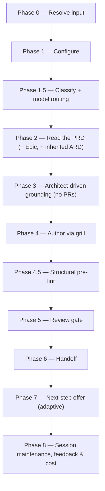

# /create-ard

Grounds on the mounted implementation repos it discovers and authors an Architecture Requirements/Decision Document (ARD) for a Product Requirements Document or one of its Epics, gated by an Opus review.

## Who runs it

`/create-ard` runs in the [pa](../roles-and-phases.md#pa--product-architecture) role, cost-attribution phase [architecture](../roles-and-phases.md#architecture) — an optional phase, since a simple single-repo PRD may genuinely not need an ARD at all (Phase 0 step 5 offers an "optionality advisory" for exactly that case, and lets the architect proceed anyway) — though in a repository of several modules the advisory adds that a PRD touching two of them is multi-component, and `/epics` will then ask for the ARD.

## Synopsis

```
/create-ard <ADDRESS> [--no-docs] [--docs <path>] [--no-arch] [--skip-costs] [--skip-feedback] [--enforce-model=<model>]
```

`/create-ard <PRD-KEY>` authors a **PRD-level** ARD. `/create-ard <EPIC-KEY>` authors an **Epic-level** ARD, which inherits the PRD-level ARD read-only and layers its own `[AD#N]` decisions on top (an Epic/area decision wins on conflict — a real contradiction is caught by `ard-reviewer` at authoring time, not left for a downstream consumer to resolve). A bare `<Epic-KEY>` also resolves, auto-finding its parent PRD. The folder's prefix sets the altitude, never the kind it asserts; a legacy folder with no prefix is placed by what it holds — a carrier asserting `kind: epic` as an Epic folder, one asserting `kind: prd` or a `brd-link.md` naming a `parent:` as a PRD folder. `--no-docs` turns off the optional Phase 3 documentation-grounding pass.

- **The BRD route** — detected from the resolved folder's `brd-link.md`, never declared. It authors an ARD into the `PRD-` slice folder [`/brd-split`](brd-split.md) carved, from that folder's `ard-seed.md`. A `BRD-` container is refused with `CREATE_ARD_BRD_NOT_SLICED`: a BRD holds `brd/`, `grounding/`, `coverage-ledger.md` and `slices.md`, and no ARD.

All three run flags apply to this command. `--skip-costs` (or `WORKFLOWS_SKIP_COSTS`) skips Phase 8's session-cost entry, still advancing the checkpoint and dropping any deferred cost record a ceded `/prompt-brainstorm` or `/prompt-grill-me` run left pending in this session (`workflows-core:run-flags` §5 step 3) — see [Session cost](../reference/session-cost.md). `--skip-feedback` (or `WORKFLOWS_SKIP_FEEDBACK`) narrows Phase 8's maintenance step to bugs-only, dispatching `defect-reporter` in place of `impl-maintenance` — see [Session feedback](../reference/session-feedback.md). `--enforce-model=<model>` (or `WORKFLOWS_ENFORCE_MODEL`) pins every dispatched agent in this run — `workflows-core:docs-grounder`, `workflows-core:code-scanner`, `ard-reviewer` (overriding its frontmatter Opus pin), `workflows-core:impl-maintenance`, and, under `--skip-feedback`, `defect-reporter` — to one model, and it is also the one flag that changes a *gate*: the tiered HARD model gate does not fire under it, since the user has already chosen the model — see [Model routing](../reference/model-routing.md).

## How it runs



Five subagents are dispatched: `workflows-core:docs-grounder` (Phase 3, read-only grounding on the shipped product docs — default ON when `$DOCS_PATH` resolves, advisory, never a gate), `workflows-core:architecture-grounder` (Phase 3, after the code scan, read-only grounding on the architecture repository — ON when `$ARCHITECTURE_REPO_PATH` resolves, advisory, never a gate), `workflows-core:code-scanner` (Phase 3, one instance per confirmed repo, up to 4 concurrent per batch), `ard-reviewer` (Phase 5, Opus-pinned), and `workflows-core:impl-maintenance` (Phase 8, session lessons-learned). The detection-tier agents run at `detection_model` (the §2.1 Sonnet chain); `ard-reviewer` runs at `review_model` (the §2 Opus chain, frontmatter-pinned, no override unless `--enforce-model`/`WORKFLOWS_ENFORCE_MODEL` enforces one), and so does `architecture-grounder`, pinned there by its dispatch rather than its frontmatter because a measurement found the Sonnet chain missing binding standards Opus found. The interview and the ARD authoring itself run inline on the session's own `current_model` rather than through a delegated subagent.

### Multi-component PRDs

A **component** is a repository, or a module inside one — a Gradle or Maven module, a workspace package, a top-level directory with its own build file, or a deploy directory such as `k8s/`. At PRD level the run proposes the components the PRD's themes touch, reading each repository's own module declarations, and you confirm, correct, add or group them; the confirmed list becomes the ARD's `components:` frontmatter. With two or more code components (a deploy directory a module only rides along on does not count) the grill also writes `## Contracts`: one row per interface between components — its `[AD#N]`, producer, consumers, kind, status and, where the contract is a code file, its path — then schema ownership, versioning and compatibility, and the landing order. `ard-reviewer` blocks a capability that lands in two or more code components with no interface row. With two or more code components and no Epics yet, the next-step offer recommends a PRD-level `/specify` before `/epics`.

## What it needs

- **The PRD on the specs repo's default branch** — gated via `require-on-main` against `specifications/<PRD>-<vslug>/`. An unmerged PRD is a hard stop, naming the branch and any open pull request. An **absent** PRD is not a stop: the run falls back to reading the resolved folder directly through and reports that it did so — `/specify` reports an absent PRD the same way, though it has no fallback to make: it reads the item from the specs tree on every run regardless, and it means `/create-ard` never requires `/create-prd` to have run first.
- **`$SPECS_PATH`** (required) — if unset, the run stops naming `SPECS_PATH` and offers to enter a path or cancel.
- **A prior PRD-level ARD**, when the run is Epic-level — resolved via `workflows-core:ard-resolution`. `status: found` inherits its `[AD#N]` invariants read-only; `status: unmerged` stops, naming the branch and any pull request; `status: none` (the common case for a first ARD) proceeds unchanged.
- **Mounted repos under `$REPOS_PATH`** — `/create-ard`'s repo discovery (Phase 3) is **mandatory**, not opt-in: it always lists top-level directories under `$REPOS_PATH`, proposes a theme-to-component mapping — repositories, or modules inside them — from the PRD/Epic's capability themes, and asks the architect to confirm, correct, add to or group it. [`/idea`](idea.md)'s `--ground-code` runs the same cheap-discovery-then-propose-then-gate mechanism, but only behind that opt-in flag. A theme that maps to no obvious repository or module is asked about outright. A repo the architect can't mount is neither invented nor silently dropped — it is escalated (`choices: ["Mount now & re-scan", "Ground only the confirmed-mounted set (record the rest as open questions)", "Specify an absolute path for this repo", "Cancel"]`) and, if descoped, recorded as an open question in the ARD rather than disappearing.
- **`$DOCS_PATH`** (optional, default `/workspace/docs`) — documentation grounding, consumed with grill-rank ranking. Turned off for a run with `--no-docs`, or pointed at another root with `--docs <path>`. Missing, unreadable, or carrying no markdown file is a silent, non-blocking skip. Turned off explicitly with `--no-docs`.
- **`$ARCHITECTURE_REPO_PATH`** (optional) — architecture grounding: a clone of your organisation's architecture repository (radar, standards, principles, patterns, ADRs). Phase 1 shows an `architecture grounding:` line with the clone's branch, commit, date, uncommitted changes and staleness; the clone is never fetched or pulled. Unset, or naming no architecture repository, it is OFF with a reason and the run proceeds as without it. Turned off explicitly with `--no-arch` ([Environment](../reference/environment.md)).
- **The team knowledge base** (optional) — `$SPECS_PATH/architecture/`, once [`/harvest-decisions`](harvest-decisions.md) has built it from merged ARDs: read as a second root, with a `team decisions:` line in Phase 1. Absent, the line says so and the run proceeds without it.
- **`grounding/`, read wherever the PRD folder holds it, on either route** — the resolved folder on a PRD-level run, and on an Epic-level run the PRD folder above the Epic, since grounding is PRD-altitude and an `EPIC-` folder never holds a `grounding/` of its own; the idea-route PRD folder as readily as the BRD-route slice, since [`/prd-ground`](prd-ground.md) now writes `grounding/code-grounding.md` and `grounding/design-grounding.md` from either. Where either file is present, its `[CG#n]`/`[DG#n]` findings **seed the Phase 3 theme set** before falling back to the PRD/Epic-derived themes — a finding whose verdict says a capability is absent is a theme worth scanning, one whose verdict says it is present names the code that already implements it, directing the scan rather than replacing it. A finding with no verifier outcome is never evidence and seeds nothing. Where the folder holds neither file, this run proceeds exactly as it did before this feature — grounding is optional to `/create-ard` and nothing in this run gates on it.

`/create-ard` never reads a pull request — there are no PRs yet at architecture time. It authors architecture only; it never writes code.

### The BRD route

With the BRD route the run is seeded by a BRD instead of a PRD, and what it needs changes accordingly:

- **No tracker is consulted.** A BRD key names a folder under `$SPECS_PATH` and nothing else, so there is nowhere outside the specs tree to look it up; the code this route reads is still reached through `$REPOS_PATH`, as on the idea route (repo discovery, below).
- **The same PRD gate as the idea route, and the same PRD read.** The route resolves a `PRD-` slice folder in every case, so there is one folder to gate and one `prd.md` to look for in it. An **absent** PRD is reported and the run architects from the resolved folder — `/create-prd` is not a prerequisite here, and the gate's `absent` branch is what keeps that true. The hard stop is a `prd.md` that exists on an unmerged branch, which is as reachable on a slice as anywhere else. **The register is gated as well.** Before the run reads `decisions.md` it executes `require-on-main` on it: a register that is not on the default branch as it stands — on a branch with its pull request still open, on no branch because its handoff was declined, or edited in the working tree — stops the run before it reads a line of it, naming the state and what resolves it (`CREATE_ARD_REGISTER_NOT_HANDED_OFF` for the declined handoff, `CREATE_ARD_REGISTER_NOT_ON_MAIN` otherwise). The usual writer of an unmerged register is the [`/brd-reconcile`](brd-reconcile.md) run that froze the customer's decisions, or a `/create-prd` that added an assumption to it, so the run never architects from customer decisions nobody has merged; an **absent** register is reported and the run architects from what the slice does hold, exactly as it did before the gate existed. `/brd-reconcile`'s offer of this command carries the `<merge-clause>` naming that wait, and the [`/brd-*` route](../brd-workflow.md)'s earlier handoffs are no substitute for the gate: on the path that advances the slice, `/brd-reconcile` hands over to this command — directly, or through [`/create-prd`](create-prd.md), which writes to the register too — and nothing on that path but this gate and the same gate in `/create-prd` and [`/specify`](specify.md) refuses to start on a register left unmerged. [`/brd-package`](brd-package.md) gates it as well, but a slice passes through that command again only when it goes back through the route — a question still held for the customer, a reopened decision's new round, or a re-grounded claim — and not on the path that advances it.
- **The BRD folder's seed, register and findings** — `ard-seed.md` (the architecture altitude of the router; `prd-seed.md` and `spec-seed.md` belong to [`/create-prd`](create-prd.md) and [`/specify`](specify.md) and are not read), `decisions.md`, and the `[CG#n]`/`[DG#n]` records in `grounding/`. Any of them being absent is reported, never a stop. **A seed file is normally absent**, because nothing on the route creates one: the one command that creates one is `/brd-intake --sort-existing`, a migration path (`/brd-reconcile` only corrects an existing one's prose) for a package authored by hand before the route existed. The register and the findings are what this route is really seeded from. A finding carrying no verifier outcome is not evidence: it seeds nothing and is never marked consumed.
- **A `PRD-` slice folder, and never a `BRD-` container.** The route is the slice [`/brd-split`](brd-split.md) carved — the folder carrying `brd-link.md` — because the artifact tree places `ard.md` only inside a PRD folder. A `BRD-` folder stops with `CREATE_ARD_BRD_NOT_SLICED` **on either route**, the moment the address resolves and the specs-repo preflight has settled the specs checkout's branch — so a stale plugin branch cannot hide a slice from the listing (save on a run carrying `specs_git: misrooted`, a misplaced `$SPECS_PATH`, where the preflight switches no branch and names a stale one it stays on): the BRD route is detected from a `brd-link.md` and a root BRD folder need not carry one, so a route-conditioned refusal would let a container fall through. A legacy unprefixed folder has no prefix to test and is answered by positive evidence instead — `coverage-ledger.md` or `brd/brd-inventory.md` present and no `brd-link.md` naming a `parent:` — so a legacy idea-route PRD folder, which carries neither file, proceeds. The stop names the slices under it, one ARD each, or — where the BRD holds none — [`/brd-split`](brd-split.md) to carve one, with that command's own two conditions stated in the offer: it gates on verified grounding findings, and it is a no-op on a ledger with no `unallocated` row.
- **No coverage-ledger check.** PRD eligibility and the allocation gate govern authoring a *PRD*; an ARD is not that artifact, so nothing this route reads to author with is a ledger row — the container refusal above is decided on the folder's prefix, not on any row. That is a decision, not an omission — [`/create-prd`](create-prd.md) is where the gate lives. The run does open the ledger in two places, and neither gates anything this run does: its next-step offer, which reads it only to decide whether [`/create-prd`](create-prd.md) can be *named* — that command refuses three BRD-route shapes, not one — and, report-only, its final report, which leaves out of the list of findings still `consumed_by: none` every finding about a requirement the slice's own ledger now shows as `covered-by`, since another BRD owns that requirement.
- **Repo discovery starts from `grounding/baselines.md`** — the repositories `/prd-ground` already pinned — rather than from PRD themes. The architect still confirms, corrects and adds, and an unmounted repo still reaches the mount-or-descope gate.
- **A slice inherits its parent BRD's ARD** read-only, exactly as an Epic-level run inherits its PRD-level one. The parent comes from `brd-link.md`'s `parent:`, never from counting segments in the key — and on this route it is always there, since the container is refused.
- **Decisions are frozen.** The grill fills what the seed leaves unstated and may not reopen a `[VD#n]` or `[CD#n]`; open decisions and open `[AS#n]` assumptions reach the ARD's `## Open questions` under their own ids. Architecture-altitude decisions seed `[AD#N]` — where they pass `ard-format.md`'s hard-to-reverse / surprising / real-trade-off test; where they do not, the run says where the content went instead.

## What it produces

**ard.md** for a PRD-level run, or the Epic folder's **ard.md** (or **ard-\<area\>.md** per area, when a Phase 4 per-area split is chosen for a large Epic spanning separable components) for an Epic-level run — written against `../../references/ard-format.md` into the feature folder (`specifications/<PRD>-<vslug>/` or its `<EPIC>-<eslug>/` subfolder), applying the no-hard-wrap prose convention. Each `### [AD#N]` decision carries a `**Binds:**`, a `**Prevents:**`, a testable `**Rule:**`, and `**Alternatives:**` — the other options weighed and why each lost. Refining an ARD — or starting fresh over one already on the specs repo's default branch — never rewrites what an existing decision requires: a changed decision is a new `[AD#N]`, and the old one stays in place with a `**Superseded by:**` line, or `**Withdrawn:**` where nothing replaces it, because downstream artifacts cite decisions by ID. A superseded or withdrawn decision binds nothing. Behind Phase 6's consent choice, the ARD is committed, pushed, and a pull request opened against the specs repo's default branch.

Where architecture grounding ran, the ARD cites each architecture-repository artifact that binds a decision as a link, opens `## Stack & invariants` with the governance baseline it was grounded on, and records every departure — from an accepted ADR or an active standard, or onto a `hold`, `retire` or unlisted technology — as an open question (`product-workflows:ard-format` § Architecture governance). On the BRD route a frozen `[VD#n]`/`[CD#n]` that conflicts with the architecture repository is not re-grilled; the conflict is an open question naming both.

**Wherever the PRD folder holds `grounding/`, on either route** — the PRD folder above the Epic, on an Epic-level run — the run writes `consumed_by: ARD` onto every `[CG#n]`/`[DG#n]` finding it actually drew on — never a finding read for context and unused, and never one with no verifier outcome — and stages that folder's `grounding/code-grounding.md` and `grounding/design-grounding.md` alongside the ARD, since an uncommitted consumption record is one no later run can read.

**On the BRD route** the ARD is **ard.md**, written into the resolved `PRD-` slice folder beside the artifacts it was derived from, on an `ard/<SLICE-KEY>-<slug>` branch — or, on an Epic-level run under the slice, into that `EPIC-` subfolder on an `ard/<EPIC>-<eslug>` branch, the branch being named from the folder the ARD lands in. Its `prd:`/`epic:` frontmatter carries the same pair the ARD resolver is given — the parent BRD's key with the slice's own as `epic:` — and `derived_from` names the PRD in that folder when there is one, else the `ard-seed.md` the ARD was actually authored from. That run additionally writes `consumed_by: ARD` onto the architecture-altitude decisions in `decisions.md` the ARD drew on — the only other write it makes into any BRD file — and stages `decisions.md` alongside the grounding files. `ard-seed.md` is read but never written: `consumed_by` is a field of a decision or finding *record*, and the seed holds neither, so its consumption is reported at file granularity instead.

A decision that replaces a team record from another PRD carries `**Supersedes:**`, which the next `/harvest-decisions` applies; one that departs from a record only locally is an open question naming it.

**`[AD#N]` decisions bind six downstream commands** once the ARD is merged, each resolving it via `workflows-core:ard-resolution`: `/create-ard` itself (an Epic-level run inheriting its PRD-level ARD), `/dev-workflows:design`, `/dev-workflows:implement`, [`/specify`](specify.md), [`/epics`](epics.md), and `/dev-workflows:ready`. An `[AD#N]` `Rule` violated downstream without a recorded "ARD deviation" is a reviewer BLOCKER in whichever of those commands hit it.

## Gates

Phase 5 dispatches `ard-reviewer`, Opus-pinned by frontmatter (`model: opus`, no override unless `--enforce-model`/`WORKFLOWS_ENFORCE_MODEL` enforces one), checking grounding integrity (every as-is claim cites a real `file:line`), `[AD#N]` well-formedness (Alternatives included), supersession — on a refine, or a fresh start over a merged ARD, it compares the ARD against a copy taken before the run, so a decision rewritten in place or dropped is caught — non-contradiction of inherited live PRD-level invariants, altitude purity (no per-repo solutions at PRD level), recorded open questions, and — with two or more code components — *Contract completeness*. `PASS` / `PASS WITH RECOMMENDATIONS` proceeds. `BLOCK` triggers one inline fix cycle — the orchestrator/grill edits the ARD directly; there is no delegated fixer — and one re-review; if still `BLOCK`, each unresolved BLOCKER is escalated individually. Cap: one fix cycle plus one re-review.

Before the review, Phase 4.5 runs a structural pre-lint (`workflows-core:pre-lint`) — advisory only, never blocking — that inline-fixes mechanical issues (a duplicate `[AD#N]`, a stray placeholder) and leaves content gaps for the grill and the author to close.

## Example

Author a PRD-level ARD, grounding on the two repos the PRD's themes point at:

```
/product-workflows:create-ard PRODUCT-1234
```

The run resolves the PRD from the merged PRD file where present, lists top-level directories under `$REPOS_PATH`, proposes a theme-to-component mapping — repositories, or modules inside them — and asks you to confirm it, scans the confirmed repos with `code-scanner`, grills you relentlessly through Context, Grounding findings, Architecture decisions, Cross-repo approach, Contracts (two code repositories make two components, so the section is written), Stack & invariants, Edge cases & risks, and Open questions, runs the structural pre-lint, then `ard-reviewer`. On a passing verdict it offers to branch, commit, push, and open a pull request, then offers the adaptive next step — with two code components and no Epics yet, `/product-workflows:specify PRODUCT-1234` first (a single-component PRD with no Epics gets `/product-workflows:epics PRODUCT-1234`), or `/product-workflows:specify PRODUCT-1234` otherwise.

Author the ARD for a decided BRD slice instead:

```
/product-workflows:create-ard EPIC-008-01
```

The run resolves `EPIC-008-01`'s folder one level under `specifications/`, reads `ard-seed.md`, the register and the verified findings, inherits the parent BRD's ARD if one is merged, proposes the repositories `grounding/baselines.md` already pinned, and grills **only the gaps** — every `[VD#n]` and `[CD#n]` the register holds as decided is an input the interview never reopens, because the customer signed it. Its next-step offer names `/product-workflows:specify EPIC-008-01`; the second option is `/product-workflows:epics EPIC-008-01` **only where the slice already holds an authored `prd.md`**. Where it does not, the replacement is resolved from the slice's own coverage ledger, because [`/create-prd`](create-prd.md) refuses three BRD-route shapes and this run has cleared only the container one: `/product-workflows:create-prd EPIC-008-01` where no claimed row is `unallocated` and at least one is `covered-here`; [`/brd-split`](brd-split.md) on the slice where a row is still `unallocated`; `/brd-split` on the parent where the slice claims nothing — with a slicing instruction, `/brd-split <PARENT-KEY> "<how to cut it>"`, where the parent's own ledger still holds an `unallocated` row (a bare run stops there with `BRD_SPLIT_NEEDS_INSTRUCTION`), bare where it holds none, and in neither form where that ledger cannot be read; and **no second option at all** where the slice is fully allocated with no `covered-here` row, since `/create-prd`'s own branch for that state names no command either. [`/epics`](epics.md) partitions a PRD and refuses a folder that holds none, and this route does not require one — `/create-prd` is not a prerequisite for `/create-ard` on it — so a slice carrying an ARD and no PRD is an ordinary state, not an error.

## See also

- [Roles and phases](../roles-and-phases.md) — what the `pa` role owns, an optional phase in the pipeline.
- [`/create-prd`](create-prd.md) — the upstream command that authors the PRD `/create-ard` reads.
- [`/harvest-decisions`](harvest-decisions.md) — keeps every merged ARD's decisions in the team knowledge base this command grounds on.
- [`/epics`](epics.md), [`/specify`](specify.md), and `/dev-workflows:design` — the downstream commands `/create-ard`'s Phase 7 offers, each of which consults the merged ARD once it lands.
- `/dev-workflows:ready` and `/dev-workflows:implement` — the two remaining consumers of `[AD#N]` invariants via `workflows-core:ard-resolution`.
- [Model routing](../reference/model-routing.md) — the classification and Opus fallback chain `ard-reviewer` runs under, plus the tiered hard model gate `/create-ard` applies for `SIGNIFICANT`/`HIGH-RISK` runs.
- [Session cost](../reference/session-cost.md), [Session feedback](../reference/session-feedback.md), and [Resume and checkpoints](../reference/resume-and-checkpoints.md) — the terminal Phase 8 bookkeeping every run emits.
- [`ard-format.md`](../../references/ard-format.md) — the canonical structure the ARD is authored and reviewed against.
- [`/prd-ground`](prd-ground.md) — the optional, ungated run, on either route, whose `[CG#n]`/`[DG#n]` findings this command reads and marks `consumed_by: ARD` wherever the PRD folder holds them — on an Epic-level run, the one above the Epic.
- `workflows-core:grounding-format` — the finding record, the six verdicts, and the two horizons this command reads a finding by.
- `workflows-core:ard-resolution` — how the six downstream commands resolve and inherit `[AD#N]` invariants.
- [The BRD-to-PRD route](../brd-workflow.md) — the `/brd-*` commands that produce the register and findings the BRD route reads, and the customer sign-off that makes those decisions unreopenable here. They produce no `ard-seed.md`: the one command that creates a seed file is `/brd-intake --sort-existing`, a migration path (`/brd-reconcile` only corrects an existing one's prose), so a reconciled BRD normally holds none and the architecture altitude arrives through the register and the findings.
