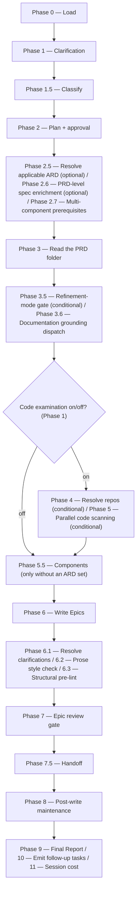

# /epics

Reads a Product Requirements Document from the resolved folder in the specs tree, optionally scans code repos, and drafts reviewed child Epic definitions.

## Who runs it

`/epics` runs in the [pe](../roles-and-phases.md#pe--product-engineering) role, cost-attribution phase [epic-refinement](../roles-and-phases.md#epic-refinement) — being in this phase means a PRD is being broken down into child Epic drafts.

## Synopsis

```
/epics <ADDRESS> [--no-docs] [--docs <path>] [--skip-costs] [--skip-feedback] [--enforce-model=<model>]
```

The positional input is a **single address** — a `<KEY>`, or an `@<path>` naming a folder in the specs tree — resolved by `workflows-core:addressing` §3.

**`/epics` accepts exactly two shapes and refuses everything else**, and every refusal of a resolved folder below is taken after the specs-repo preflight has settled the specs checkout's branch — a missing or unresolvable address (`EPICS_NEEDS_KEY`, `EPICS_NOT_FOUND`) stops earlier, before there is a folder to refuse — so a stale plugin branch cannot make a file on the default branch look absent. On a run carrying `specs_git: misrooted` (a misplaced `$SPECS_PATH`) the preflight switches no branch; it names a stale one it stays on, and that branch can still do so. A `PRD-` folder partitions into new Epics; an `EPIC-` folder holding its `epic.md` **that has a PRD above it** re-refines that Epic. A **stand-alone `EPIC-` folder** — one holding an `epic.md` with no PRD above it — is refused (`EPICS_EPIC_NOT_UNDER_PRD`). An `EPIC-` folder holding no `epic.md` is refused wherever it sits, with `EPICS_NO_PRD`: no command writes one, so it is hand-made or left by an interrupted run, and the stop's own row for it names `/epics <PRD-KEY>` where the folder above holds a PRD — which drafts that PRD's Epics in folders of its own, this one not among its inputs, so the stop says the folder may be removed once nothing in it is wanted — `/create-prd <PARENT-KEY>` first where that `PRD-` folder holds none yet — on a BRD slice only where that slice's own coverage ledger clears the two data refusals, and otherwise naming what the ledger calls for, or nothing where the ledger is missing; anywhere else, no command. A **`BRD-` container** is refused too (`EPICS_BRD_NOT_SLICED`, taken on the directory prefix after the specs-repo preflight and before any other read, naming the `PRD-` slices under it, one set of Epics each). Where the folder resolved through the legacy unprefixed fallback and carries no prefix to read, the same refusal is taken on positive evidence that the folder is a BRD — it carries `coverage-ledger.md` or `brd/brd-inventory.md` and no `brd-link.md` naming a `parent:` — the one rule every command that tests a folder's level shares, stated in [`coverage-ledger-format.md`](../reference/references.md) §5.1. A legacy **idea-route** PRD folder carries neither file, so the refusal does not fire on it. **Epics come from a PRD only**, and `/epics` is the only command in the plugin that creates an `EPIC-` folder — [`/create-ard`](create-ard.md) and [`/specify`](specify.md) both stop on an absent one rather than minting it.

**The gate is `prd.md`'s own `kind: prd`, never the folder's asserted `kind:`.** A `PRD-` slice folder carved by [`/brd-split`](brd-split.md) asserts `kind: brd` in its `brd-link.md`, so a gate on the asserted kind would refuse every slice and accept nothing. [`/create-prd`](create-prd.md) cannot take this test — it is the run that writes `prd.md` — but `/epics` can, because by the time it runs the PRD exists. The Epic side is the same test one level down: `epic.md`'s own `kind: epic`. Neither reads a directory name, so a legacy unprefixed folder is classified exactly as a prefixed one is. A `PRD-` folder in which no PRD has been authored yet is refused too (`EPICS_NO_PRD`, after the specs-repo preflight). That stop names [`/create-prd`](create-prd.md) **only where that command can run**: it refuses three BRD-route shapes, not one, and on a BRD-route slice the two data refusals on the slice's own ledger are tested first — a row still `unallocated` names [`/brd-split`](brd-split.md) on the slice instead, a slice claiming nothing names `/brd-split` on the parent — with a slicing instruction, `/brd-split <PARENT-KEY> "<how to cut it>"`, where the parent's own ledger still holds an `unallocated` row (a bare run stops there with `BRD_SPLIT_NEEDS_INSTRUCTION`), bare where it holds none, and in neither form where that ledger cannot be read, and a fully-allocated slice with no `covered-here` row names **no command at all**, because `/create-prd`'s own branch for that state names none either; a slice whose coverage ledger is missing or unreadable names no command either, and reports the missing file. An idea-route PRD folder has no ledger and takes `/create-prd <KEY>` directly. A `prd.md` that asserts no `kind: prd` is no PRD to `/epics`, but [`/create-prd`](create-prd.md) counts any `prd.md` as found, so there the stop also names [`/update-prd`](update-prd.md), and adding the `kind: prd` and `key:` the file's format carries lets `/epics` read it as it stands.

All three run flags apply to this command. `--skip-costs` (or `WORKFLOWS_SKIP_COSTS`) skips Phase 11's session-cost entry, still advancing the checkpoint and dropping any deferred cost record a ceded `/prompt-brainstorm` or `/prompt-grill-me` run left pending in this session (`workflows-core:run-flags` §5 step 3) — see [Session cost](../reference/session-cost.md). `--skip-feedback` (or `WORKFLOWS_SKIP_FEEDBACK`) narrows Phase 8's Agent 4 to bugs-only, dispatching `defect-reporter` in place of `impl-maintenance` — see [Session feedback](../reference/session-feedback.md). `--enforce-model=<model>` (or `WORKFLOWS_ENFORCE_MODEL`) pins every dispatched agent in this run — `workflows-core:docs-grounder`, `workflows-core:code-scanner`, `epic-writer`, `prose-style:prose-style-checker`, `workflows-core:doc-fixer`, `epic-reviewer` (overriding its frontmatter Opus pin), `workflows-core:impl-maintenance`, and, under `--skip-feedback`, `defect-reporter` — to one model; if no Opus resolves, `epic-reviewer` otherwise falls to the Sonnet floor and records the degradation, which does not happen under enforcement since the enforced model is used instead — see [Model routing](../reference/model-routing.md).

## How it runs

`/epics` has 23 `## Phase` headings — the most in this plugin. The diagram below collapses adjacent phases that form one user-visible step, and shows the fork that most changes which phases run: whether code examination is on. Phases 2.7 and 5.5 are conditional as well — 2.7 only on a multi-component PRD, 5.5 only without an ARD set.



Seven subagents are dispatched: `workflows-core:docs-grounder` (Phase 3.6, read-only grounding on the shipped product docs — default ON when `$DOCS_PATH` resolves, advisory, never a gate), `workflows-core:code-scanner` (Phase 5, one instance per confirmed repo, up to 4 concurrent, only when code scan is ON), `epic-writer` (Phase 6, the sole author of the Epic drafts), `prose-style:prose-style-checker` (Phase 6.2, a non-gating quality pass on the Epic drafts), `workflows-core:doc-fixer` (Phases 6.2 and 7, fixing style violations and surviving BLOCKER/MAJOR review findings), `epic-reviewer` (Phase 7, Opus-pinned), and `workflows-core:impl-maintenance` (Phase 8, session lessons-learned). The detection-tier agents (and `epic-writer` when the run is `MODERATE`) run at `detection_model`; `epic-reviewer` keeps its frontmatter Opus pin (no override unless `--enforce-model`/`WORKFLOWS_ENFORCE_MODEL` enforces one).

### Multi-component PRDs

Every Epic gets one `target:` — the one component it changes — from the PRD-level ARD's `components:`, or, with no ARD, from the components you confirm after the code scan, or from the targets existing Epics already carry when the scan is off — asked only when two or more are proposed. A capability that spans components becomes one Epic per component, linked through `## Dependencies` in the ARD's landing order. With two or more code components, each Epic's `## Contract` cites the ARD interfaces it produces or consumes, a consumer's Independent Test runs against a stub of each (an interface that already exists is used as it runs), and a new or changed interface whose contract is a code file gets its own Epic, first in order, whose artifact its consumers then use as built. Refining one Epic (`/epics <EPIC-KEY>`) splits it where you name, at plan approval (*Revise plan*), work that moves to another component of the set, or where its scope already spans components — drafting an Epic for each other component. A change to a deploy directory of the same repository that exists only to deploy the Epic's target rides along as an `- Also touches:` line instead of becoming an Epic. Before drafting, on a PRD with two or more code components, the run checks that the ARD's `## Contracts` and a PRD-level `specification.md` are on the specs repo's default branch and recommends running whichever is missing first; you can split without them, and the final report records that you did. `epic-reviewer` blocks an Epic with no target or one whose scope spans components.

## What it needs

- **A PRD folder, or an Epic folder under one** — a `mode: direct` prompt is rejected outright (`EPICS_NEEDS_KEY`), and so are the shapes above: a stand-alone `EPIC-` folder, an `EPIC-` folder holding no `epic.md`, and a `BRD-` container. An `EPIC-` address sets `focus_key` (Phase 0 step 1b) and switches the run to `mode: refine`, with `prd_dir` resolved to the Epic folder's parent; a `PRD-` address leaves `focus_key` null and drafts the full partition. A PRD whose `prd.md` states no requirements stops in Phase 0, after the specs-repo preflight and the step 1b gate and before any question, with `EPICS_PRD_NO_REQUIREMENTS`, naming `/product-workflows:update-prd` to add them, rather than drafting against an empty coverage set that every Epic would pass.
- **An optional PRD-level `specification.md`** — this is `/epics`' `require-on-main`-gated input (Phase 2.6); the PRD-level ARD below is gated too, via `workflows-core:ard-resolution`, which resolves `status: unmerged` through `require-on-main` as well. **Absent** is a silent skip (`vi_spec_present: false`) — the common case, since `/specify` usually runs per-Epic *after* `/epics` — with no prompt and no extra output, save on a multi-component PRD, where Phase 2.7 asks for it (see *Multi-component PRDs*). **Unmerged** is a hard stop, naming the branch and any open pull request: a spec that exists but hasn't landed on the default branch is weaker grounding than the one about to arrive, and Epics drafted against it would need redoing.
- **An optional PRD-level ARD** (Phase 2.5), resolved via `workflows-core:ard-resolution` with `epic: null` (Epics don't exist yet). `status: none` skips silently and proceeds exactly as before, save on a multi-component PRD (see *Multi-component PRDs*); `status: unmerged` stops, naming the branch and any pull request; `status: found` carries its `[AD#N]` invariants into both `epic-writer` and `epic-reviewer`.
- **`$DOCS_PATH`** (optional, default `/workspace/docs`) — resolved in Phase 2, **before** the Phase 2.5/2.6 ARD and spec gates, a deliberate ordering exception to the usual gate-first sequencing: it is the run's only consent-bearing step (an index build or a capped refresh), so it must resolve before any of the run's real work, rather than risk a later phase stopping after that consent work already happened. Missing, unreadable, or empty is a silent, non-blocking skip. Turned off with `--no-docs`.
- **Mounted repos under `$REPOS_PATH`** — only consulted when code examination is ON (default). The repo list is auto-derived from sibling/parent Epics' `implementation.md` records and, where a PRD-level ARD lists components, their repositories — or entered manually. A repo that resolves to zero matches is escalated, never silently dropped; an entirely empty resolved list still lets the run proceed without a code scan if the user chooses.

## What it produces

One `EPIC-<PRD-KEY>-NN-<eslug>/` folder per new or refined Epic under the resolved PRD folder, each holding `epic.md`. The key is minted as the next unused two-digit segment, proposed and overridable, validated and re-prompted rather than coerced. `_coverage.md` is PRD-holistic and lands beside `prd.md`, never inside an Epic folder.

**The drafts are handed off like every other phase's deliverable.** Once the review gate has settled, Phase 7.5 offers branch + commit + push + pull request for every `epic.md` the run wrote and `_coverage.md`, behind a consent choice (`workflows-core:phase-handoff`), on an `epics/<PRD-KEY>-<slug>` branch named from the PRD folder — a later `/epics` run on the same PRD reuses it while its pull request is open. The run's session files ride the same branch, save in session-branch mode, where they go to your session branch. [`/specify`](specify.md) and [`/create-ard`](create-ard.md) at Epic altitude stop while an Epic sits on that branch unmerged, so merging the pull request is the step between this command and the next. Declining leaves the drafts written and uncommitted: the next phase reads a new Epic from the folder as it stands and reports it, but stops on an Epic already on the default branch that this run edited until the edit is committed — which is why a run that edited one offers the choice warning that the next phase will stop — and the specs-repo preflight warns about uncommitted drafts on every later run until they are committed. This command used to commit nothing it drafted — a rule kept from a version that wrote its drafts outside any repository the plugin managed — so its Epics reached the remote only when someone committed them by hand.

## Gates

Phase 7 dispatches `epic-reviewer`, Opus-pinned, checking goal clarity, acceptance-criteria testability and wording, scope boundaries, cross-Epic dependencies (each need built or named; a decision several Epics adopt stated alike), and non-duplication with existing Epics under the parent PRD — and, where the run has a known set, *Single target* (measured against the target repositories' module and deploy directories where the run can read them) and *Contract citation*. Findings are triaged by the orchestrator (`workflows-core:finding-triage`) before `doc-fixer` ever sees them — each finding verified at the location it names, every dismissal and every unverified finding recorded with a reason, survivors only handed to the fixer. `BLOCK` invokes `doc-fixer` for BLOCKER/MAJOR findings and re-reviews once, passing the fixer's own report back as `claims_file` so the re-review falsifies the fixer's account rather than assuming it; the re-review is triaged too: a `BLOCKER` surviving that triage, or a verdict you keep, is escalated individually, and a second `BLOCK` that no surviving `BLOCKER` supports is yours to settle. `PASS WITH RECOMMENDATIONS` fixes MAJOR findings only, then offers the re-review the cap still holds once — taken, it is dispatched and triaged like the `BLOCK` re-review; declined, the final report says the verdict predates the fixes. `PASS` proceeds. Cap: one fix cycle plus one re-review. A finding the run leaves open whose fix needs a decision it did not take is written into its Epic as a `[NEEDS CLARIFICATION]` marker, up to three per Epic, so the next run asks it: `/specify`'s grill, or a later `/epics` run's clarification gate.

Ahead of the review, Phase 6.2 runs `prose-style-checker` unconditionally as a **non-gating quality pass** — the actual gate on this command is `epic-reviewer` (Opus) alone. It is the **primary** style checker rather than a fallback, since Epic definitions are specs-tree content with no repo-side prose linter to fall back from, and `prose-style` is a declared dependency of `product-workflows`, so there is no absent case to skip. The Epic's required headings are passed as `fixed_headings` and never checked, `## Independent Test` included, and `## Contract` where an Epic carries one. A finding on text you chose when answering a clarification is put to you before any fixer runs — take its rewording or keep your answer — and never rewritten silently; a suggested answer is read against the ARD decisions and PRD requirements it touches before it is offered, and offered with any contradiction named. Phase 6.3 then runs a structural pre-lint (`workflows-core:pre-lint`) — advisory only, checking required headings, Given/When/Then acceptance criteria, and the `[NEEDS CLARIFICATION]` cap.

## Example

Split a PRD with two existing Epics not yet covering all its scope:

```
/product-workflows:epics PRODUCT-1234
```

The run resolves the PRD, asks for the output directory and whether to scan code (default on, repos auto-derived from sibling Epics' PR links), resolves any PRD-level ARD and specification, reads the PRD folder at `prd-plus-epics` depth, scans the confirmed repos in batches of up to 4, delegates the drafting to `epic-writer`, runs the Prose style check and structural pre-lint, then `epic-reviewer`. On a passing verdict it offers the handoff — taken, the Epics and `_coverage.md` go up on an `epics/` branch with a pull request — then reports the Epics written and `_coverage.md`'s gap list, and recommends `/product-workflows:specify <EPIC>` per drafted Epic as the next step, once that pull request is merged — one address, the Epic's own. Publishing the Epics to a tracker, where a team keeps them there, remains a manual step.

## See also

- [Roles and phases](../roles-and-phases.md) — what the `pe` role owns, including `/epics`' Phase 2.6 gate, which always targets the PRD dir's `specification.md` rather than a nested per-Epic one, since Epics don't exist yet when `/epics` runs.
- [`/create-prd`](create-prd.md) and [`/create-ard`](create-ard.md) — the upstream commands whose PRD and (optional) ARD `/epics` reads.
- [`/specify`](specify.md) — the downstream command normally run once per drafted Epic, which stops while that Epic is on an unmerged `epics/` branch; a PRD with 0 Epics that reaches `/specify` first is itself offered a link back to `/epics`, but nothing gates the order.
- [Model routing](../reference/model-routing.md) — the classification rules and the `epic-reviewer` Opus pin.
- [Session cost](../reference/session-cost.md) and [Session feedback](../reference/session-feedback.md) — the terminal Phase 9–11 bookkeeping every run emits. Follow-ups are the third emitter in that same tail; the page describing them ships in `dev-workflows`.
- `workflows-core:ard-resolution` — how the optional PRD-level ARD is resolved and inherited.
- `workflows-core:finding-triage` — the triage step run between `epic-reviewer` and `doc-fixer`.
