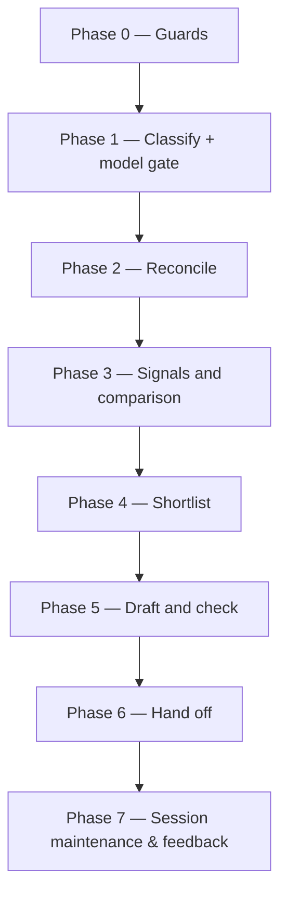

# /promote-decisions

Promotes the team's architecture decisions to organisation ADRs, and proposes superseding ADRs where teams keep departing from one. It is run inside the architecture repository and opens two pull requests.

## Who runs it

The product architect, after [`/harvest-decisions`](harvest-decisions.md) has built the team knowledge base. Start it in a session whose project is the architecture repository: where other repositories are mounted read-only, the run stops before writing anything.

## Synopsis

```
/product-workflows:promote-decisions [--reconsider] [--max <n>] [--skip-feedback] [--enforce-model=<model>]
```

- `--reconsider` proposes records marked `declined` or `rejected` again.
- `--max <n>` caps each shortlist (default 10).
- Run flags (`workflows-core:run-flags`): `--skip-feedback` and `--enforce-model`. The command emits no cost entry, so `--skip-costs` does not apply.

## How it runs



1. **Reconcile.** Every ADR whose Context opens with `Origin: team decisions …` updates the records it names: `proposed`, then `accepted` or `rejected` as the ADR's status says.
2. **Signals.** A bundled script reads the knowledge base and the specs tree on the default branch. It finds how often each decision is cited from other PRDs, where it was departed from, and which ADRs designs and ARDs keep departing from.
3. **Comparison.** `workflows-core:promotion-scout` (Opus, read-only) marks each candidate `covered`, `conflicts` or `new` against the architecture repository, and groups the records of different teams that decide the same thing.
4. **Shortlist.** You get two ranked lists, promotions and superseding proposals, each row with its reasons. You answer by number: draft, decline (with a reason), or mark as already covered.
5. **Draft and check.**
   - **Scaffold.** The repository's own ADR template is followed: the next number, its file-name pattern, its catalog entry where it keeps one.
   - **Write.** `workflows-core:adr-drafter` (Opus) writes the body. The command adds the overview row.
   - **Check.** The repository's own decision tests run, where it has any.
6. **Hand off.** One pull request in the architecture repository with the drafts. One in the specs repository on `kb/promote-<date>`, recording `promotion`, `promoted_to` and `promotion_note` on each record.

## What it needs

- **A writable architecture repository**: the session's own project — one holding an ADR folder and a catalog or radar file — or `$ARCHITECTURE_REPO_PATH` where that clone is writable. Its checkout must be clean, on its default branch and not ahead of origin. A completed run returns it to that branch.
- **`$SPECS_PATH`**, with `architecture/index.yaml` on its default branch, no uncommitted change under `architecture/`, and no unmerged `kb/` branch.
- **`python3`** — the signals are product-workflows' bundled script `scripts/promotion-signals.py`, run with `--layout prd`. `uv` is optional: it runs the repository's decision tests from prebuilt wheels, which needs the network; without it the run says the tests did not run.
- **`gh`** (optional): it opens both pull requests, and checks whether a pending promotion's pull request was closed.

## What it produces

- **In the architecture repository:** one `proposed` ADR per pick, its catalog entry where it keeps one and its overview row, on a branch, with a pull request. No existing ADR is edited: a superseding proposal changes the old ADR only when a human accepts it.
- **In the specs repository:** the promotion keys on each decided record, on a `kb/promote-<date>` pull request. The next harvest preserves them, and its README marks a record whose ADR was accepted.

## Gates

Each of these stops the run before anything is written:
- the architecture repository is read-only, dirty, off its default branch, or ahead of origin;
- the knowledge base is missing;
- an earlier `kb/` branch is unmerged, or records under `architecture/` are uncommitted;
- a non-Opus session, unless you override.

A failing repository test, or a mark the script refuses, stops it before the commit, on the run's branch: the stop names it and how to go on. No secret scanner ships with product-workflows, and the final report says so.

## Example

```
/product-workflows:promote-decisions --max 5
```

## See also

- [`/harvest-decisions`](harvest-decisions.md) — builds the records this command promotes.
- [`/create-ard`](create-ard.md), [`/specify`](specify.md) and `/dev-workflows:design` — ground on the records, and skip one once its ADR is accepted.
- `workflows-core:architecture-promotion` — the procedure; `workflows-core:architecture-kb` — the record format.
