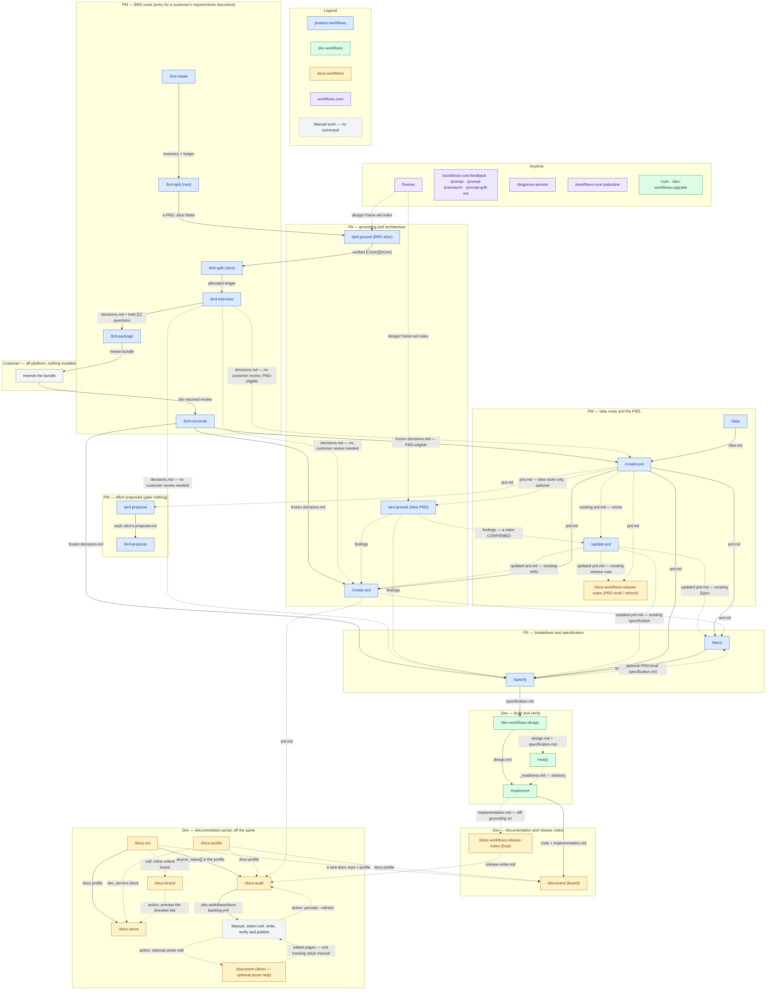

# Family map

This page shows the whole plugin family on one diagram: every slash command of `product-workflows`, `dev-workflows`, `docs-workflows` and `workflows-core`, from the two ways work enters — `/idea` and `/brd-intake` — to shipped code, its documentation and its release notes. Each lane is a **role**. Each command is **coloured by the plugin that ships it**. Labels name artifacts or explicitly marked actions; gray manual steps are not commands.

## Reading it

- **Solid arrows carry the main inputs**, to commands or to manual work. **Dashed arrows** carry optional inputs, conditional reruns, advice (`/ready`'s verdict), or explicit `action:` / `call:` labels. An artifact edge is not an automatic invocation. Whether a command also waits for its input to be merged is a per-command gate, described on its own page.
- **`/prd-ground` is one command drawn separately for each route**, not a missing `/brd-ground`. A root BRD is split first, then each slice is grounded before its allocation walk and interview. An idea-route PRD may be grounded but never enters `/brd-split`. BRD authoring also reads the slice's findings after the decision handoff; those extra input edges are omitted here.
- **The BRD route joins the PRD ladder at the slice folder**, not at an `idea.md`. The three authoring commands are alternatives, not a sequence, and each gates the slice's `decisions.md`. `/brd-reconcile` offers them once the customer's answers are frozen. `/brd-interview` offers them directly when every question was settled from the findings, so the slice needs no customer review — `/create-prd` there, as after a reconciliation, only where a row the slice claims is `covered-here`.
- **`/update-prd` offers reruns for existing downstream artifacts** — architecture, specification, Epics and release notes — and recommends a rerun when the update invalidates one. These edges do not require creating artifacts that do not yet exist. The specification-to-Epics edge is optional enrichment from a PRD-level `specification.md`, not a requirement to specify before splitting.
- **`/docs-workflows:release-notes` is drawn twice** to show PRD-driven drafts or refreshes and the post-implementation note. The final run reads nothing `/document` writes, so the two documentation commands are independent. This command, `/dev-workflows:upgrade`, `/workflows-core:statusline` and `/workflows-core:feedback` use qualified names because their bare names collide with built-ins, and `/dev-workflows:design` because its bare name does on the accounts Claude Code's own `/design` is switched on for.
- **The audit backlog has a manual implementation stage.** Select an actionable unit, write its page, maintain its `unit:` metadata and backlog `page_path` / `status`, verify its claims, and publish it. `/document` direct mode can help with a described prose edit, but it never reads the backlog or manages unit status; keyed mode remains the feature-documentation route. `/docs-write` is planned, not shipped. The `docs-workflows` documentation route page describes the manual procedure; `--refresh` re-audits coverage and does not replace verification.
- **`/ready` sits beside the spine, not on it.** Its verdict is advice `/implement` reads; it blocks nothing.
- **The Anytime lane hands no deliverable to the pipeline** except `/frames`' frame-set index, which `/prd-ground`'s design grounding needs. The portal lane prepares the documentation repository `/document` writes into, and `/docs-serve` only previews it.

## The detail, per plugin

Each plugin's own workflow page draws its commands in full, with the loops and conditions this map leaves out:

- `product-workflows` — its Workflow overview page, and its BRD workflow page for the six-command route with its re-entry loops.
- `dev-workflows` — its Workflow overview page.
- `docs-workflows` — its Workflow overview page, and its docs workflow page for the portal procedure.
- `workflows-core` — [Workflow](workflow.md), for what this plugin gives the other three.

The roles are described on each plugin's Roles and phases page; this plugin's own is [Roles and phases](roles-and-phases.md).
